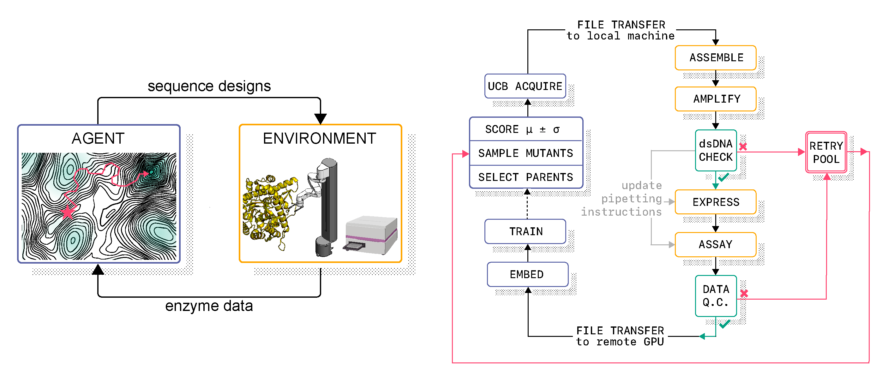

# PRAXIS — PRotein Autonomous eXperimental Interaction System

### Learning protein function through autonomous experimental interaction

PRAXIS is a closed-loop learning system that acquires knowledge through **autonomous
experimental interaction** — iteratively perturbing a biological system, measuring its
response, and learning from the resulting feedback. It couples a **generative protein
language model** for sequence design with a **fully autonomous robotic laboratory** for
gene assembly, protein expression, and biochemical characterization, in a continuous
experimental loop.

At each iteration the model proposes protein variants, the laboratory constructs and
characterizes them, and the resulting measurements are fed back into the model to guide the
next round of design. Applied to Family 1 glycoside hydrolase (GH1) enzymes, the system runs
as a coordinated **multi-agent** platform in which three agents independently optimize activity
toward glucose, xylose, and mannose while sharing experimental knowledge through a common
learning model — discovering enzyme variants with substantially altered substrate
specificities toward non-native sugars across a fully autonomous multi-week campaign.

This repository accompanies:

> **Learning protein function through autonomous experimental interaction**
> Coban Brooks, Pascal Notin, Philip A. Romero
> bioRxiv (2026) · [10.64898/2026.08.14.744985](https://www.biorxiv.org/content/10.64898/2026.08.14.744985v1)

<p align="center">
  
</p>

## Repository layout

| Path | Role in the loop |
|------|------------------|
| [`agent/`](agent) | The **generative agent**: a ProteinNPT-based protein language model that learns sequence–function relationships from accumulated measurements and proposes new variants via uncertainty-guided (UCB) acquisition. |
| [`agent/insilico_analysis/`](agent/insilico_analysis) | **In-silico benchmarks**: deep mutational scanning datasets (Pab1, GB1, Ube4b, avGFP) used as ground-truth oracles to validate the agent's search before coupling it to the laboratory. |
| [`environment/`](environment) | The **experimental environment**: software that operates the autonomous robotic laboratory — constructing and characterizing designed variants and returning measurements to the agent. |

The agent and environment run independently and communicate over HTTP/SSH, so the agent and
benchmarks can be run with no laboratory hardware.

## Quickstart

### 1. In-silico benchmarks (no laboratory required)

Validate the agent's ability to select informative experiments against deep mutational scanning
datasets used as ground-truth oracles:

```bash
cd agent
conda env create -f self_driving_env.yml && conda activate self_driving_env
bash setup.sh                                       # download ESM2 + Tranception weights (DMS datasets are bundled)
bash insilico_analysis/run_full_benchmark.sh 0      # 4 datasets × 5 search strategies × 5 seeds
```

Each search starts from a 10-sequence random seed (round 1) and runs 19 acquisition rounds of
10 sequences each (200 measured in total), comparing ProteinNPT + UCB against simpler baselines. See
[`agent/README.md`](agent/README.md#in-silico-benchmarks).

### 2. The agent (closed-loop design)

```bash
cd agent
bash self_driving_single.sh        # a single agent / objective
bash self_driving_multiple.sh      # the multi-agent campaign (glucose / xylose / mannose)
```

See [`agent/README.md`](agent/README.md).

### 3. The environment (autonomous laboratory)

```bash
cd environment
python -m venv venv && source venv/bin/activate
pip install -r requirements.txt
cp configs/lab_config.example.yml configs/lab_config.yml   # then edit
python lab_controller.py
```

See [`environment/README.md`](environment/README.md).

## Data & weights

The benchmark oracle datasets (`agent/insilico_analysis/dataset_oracle/<protein>/<protein>_SeqFxnDataset.pkl`,
~80 MB for Pab1/GB1/Ube4b/avGFP) are **bundled in the repository**, so the benchmarks are
self-contained. Model weights (ESM2-650M, Tranception Large) are downloaded by `agent/setup.sh`.
Precomputed embeddings and closed-loop result databases are regenerated by the agent's
`precompute_*` scripts and optimization runs.

## Dependencies

The agent builds on [ProteinNPT](https://github.com/OATML-Markslab/ProteinNPT)
(`proteinnpt==1.5.1`, installed via the conda environment file). ESM2 and Tranception weights are
downloaded by `agent/setup.sh`.

## Citation

```bibtex
@article{brooks_autonomous_interaction,
  title   = {Learning protein function through autonomous experimental interaction},
  author  = {Brooks, Coban and Notin, Pascal and Romero, Philip A.},
  year    = {2026}
}
```

## License

Apache License 2.0 — see [LICENSE](LICENSE) and [NOTICE](NOTICE).
